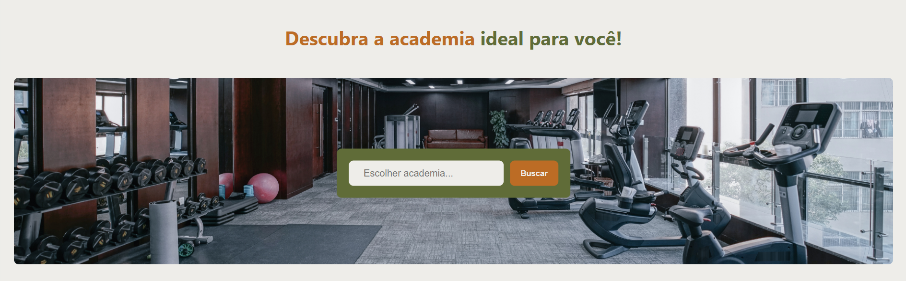
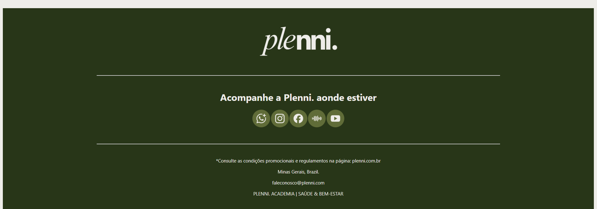
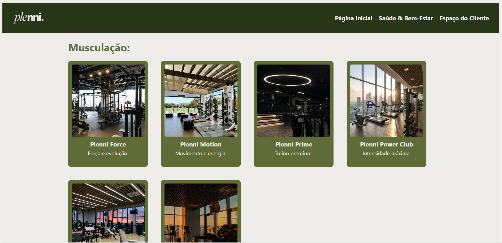
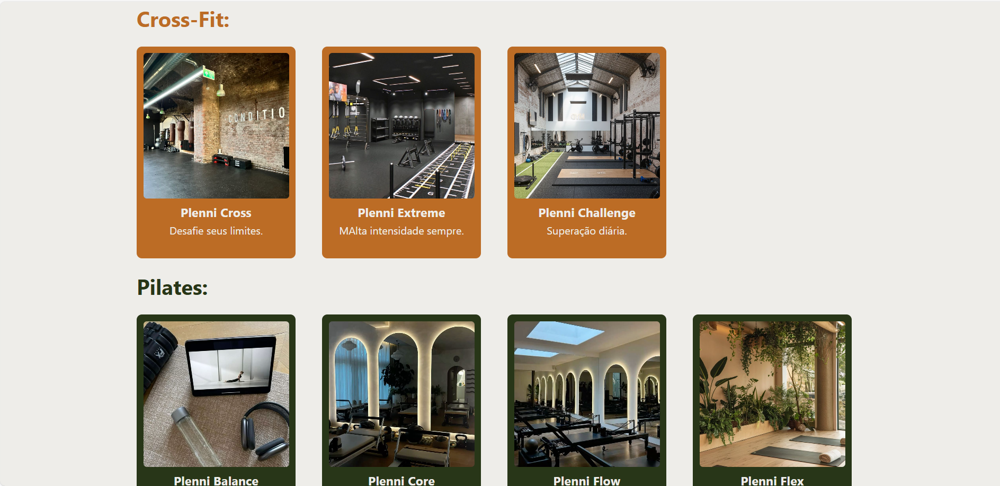
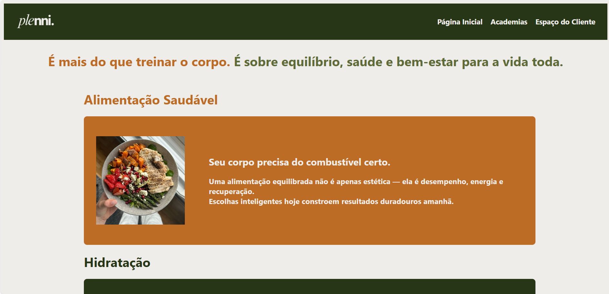
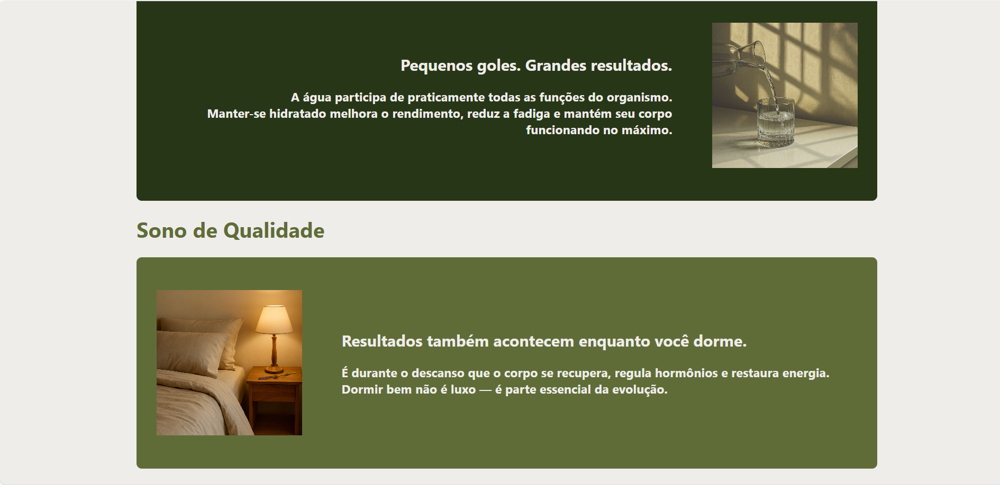
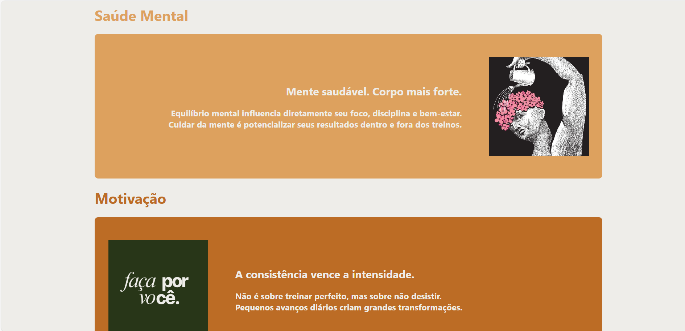
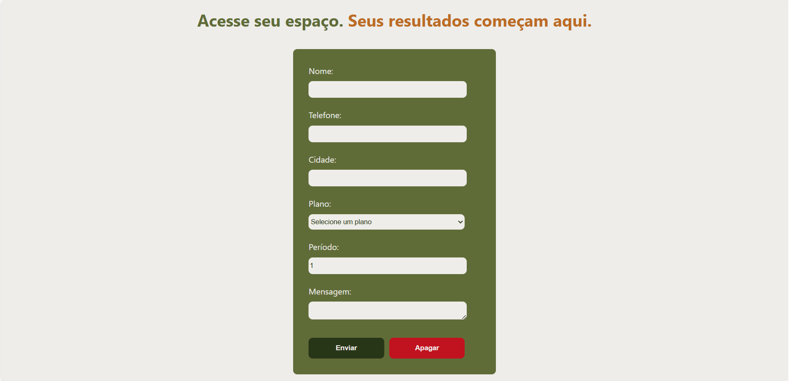

# Plenni | Projeto de Site de Academia

Este é um projeto de site para uma **academia fictícia chamada “Plenni”** — criado como parte do meu portfólio.  
Ele apresenta um layout responsivo em HTML/CSS para divulgar planos, localização e chamadas promocionais de forma moderna e profissional.

---

## ✨ Sobre o Projeto

O objetivo desse site é demonstrar habilidades de:

- Estruturação de páginas com HTML semântico  
- Design visual com CSS  
- Navegação simples e intuitiva  
- Simulação de busca de academias  
- Projeto preparado para portfólio

---

## 📌 Tecnologias Utilizadas

- **HTML5** — Estrutura de páginas web
- **CSS3** — Estilização visual
- Layout adaptado para facilitar leitura e reutilização

---

## 🚀 Funcionalidades

- Cabeçalho com menu navegável  
- Banner promocional  
- Campo de busca de academias  
- Seção de planos e preços com destaque de promoção  
- Rodapé com redes sociais e informações de contato

---

## 📷 Visual
### Início

### Academias

### Saúde & Bem-Estar

### Espaço do Cliente

---

## 📄 Licença

Projeto criado para fins de estudo e portfólio.

---

## ✉️ Contato

Desenvolvido por **Giovana Valeriano**  
📧 giovvaleriano@gmail.com  
📍 Minas Gerais, Brazil

---

Obrigado por visitar o projeto! 😄

Este projeto foi desenvolvido com foco em aprendizado e prática.

Sugestões e contribuições são sempre bem-vindas. ⭐🚀
